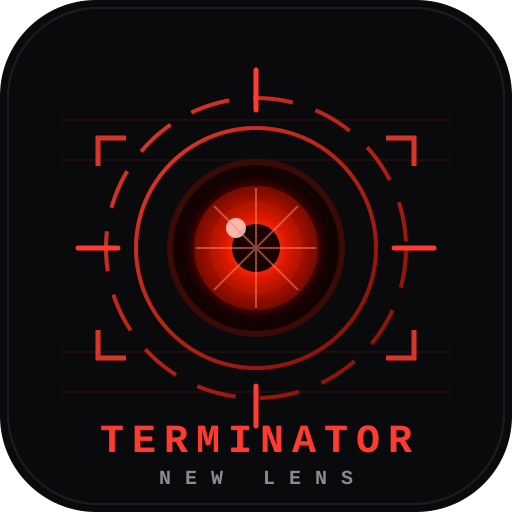

# Terminator New Lens

Real-time machine-vision HUD — camera analysis, object detection, and threat assessment with a Terminator-style overlay. Powered by Gemini or a local LM Studio model.

# Run and deploy your AI Studio app

This contains everything you need to run your app locally.

View your app in AI Studio: https://ai.studio/apps/efd2f807-2982-4ee5-aa8f-6f0766d2a4be

## Run Locally

**Prerequisites:**  Node.js

1. Install dependencies:
   `npm install`
2. Set the `GEMINI_API_KEY` in [.env.local](.env.local) to your Gemini API key (optional if using LM Studio)
3. Run the app:
   `npm run dev`

## Local Mode (LM Studio — no Google API needed)

1. In LM Studio, load a **vision-capable** model (e.g. `gemma-4-e4b-it`, a Qwen-VL, or LLaVA variant).
2. Start the local server (Developer tab) and enable **CORS** in the server settings.
3. In the app, click **UPLINK CONFIG** (top right of the HUD) → select **LOCAL (LM STUDIO)**.
4. Set the endpoint (default `http://localhost:1234`), hit **SCAN** to list loaded models, and resume scanning. No frames ever leave your machine.
